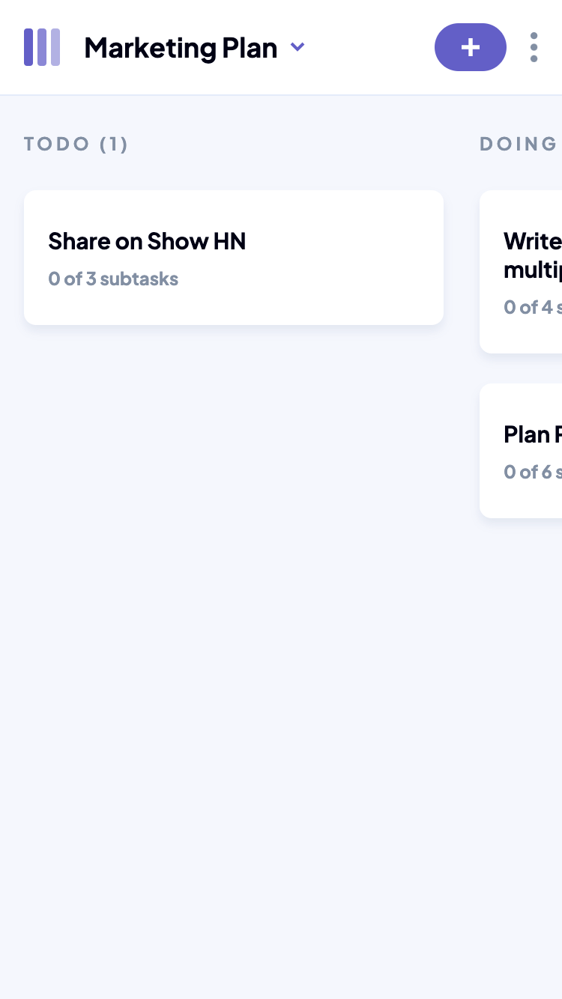

# Kanban-Task website

This is a solution to the [Kanban task management web app challenge on Frontend Mentor](https://www.frontendmentor.io/challenges/kanban-task-management-web-app-wgQLt-HlbB).

## Screenshots

<table>
  <tr>
    <td></td>
    <td></td>
    <td></td>
  </tr>
	
</table>
<table>
	<tr> 
    <td></td>
    <td></td>
    <td></td>
</tr>
</table>

## Links

-   Live Site URL: [Kanban - Vercel](https://portfolio-flax-pi-68.vercel.app/)

## Tech Stack

**Frontend:**

-   _React 19_
-   _React Router_

-   _Tailwind CSS 4_
-   _Vite_
    **State Management**
-   _Redux_
    **Forms & Validation:**
-   _Formik_
-   _Yup_
    **Animations & SVG**:
-   _Framer Motion_ (installed as motion)
-   _React SVG_
    **Utilities**
-   _uuid_

## What I learned

I learned how to fully utilize Framer Motion’s AnimatePresence to manage modal transitions cleanly and responsively:

```javascript
<AnimatePresence>
	]
	{isOpen && (
		<motion.div
			className="backdrop"
			variants={backdropVariants}
			initial="hidden"
			animate="show"
			exit="exit"
		>
			<motion.div
				className="modal-content"
				variants={modalBlock}
				onClick={(e) => e.stopPropagation()}
			></motion.div>
		</motion.div>
	)}
</AnimatePresence>
```

I also explored Framer Motion's drag functionality and how to enhance user experience with:

## Useful Resources

-   [Framer-motion: Drag and Drop](https://hohanga.medium.com/framer-motion-variants-and-drag-and-drop-b96f7620d339) - This helped me to unerstand drag and drop functionality better.
