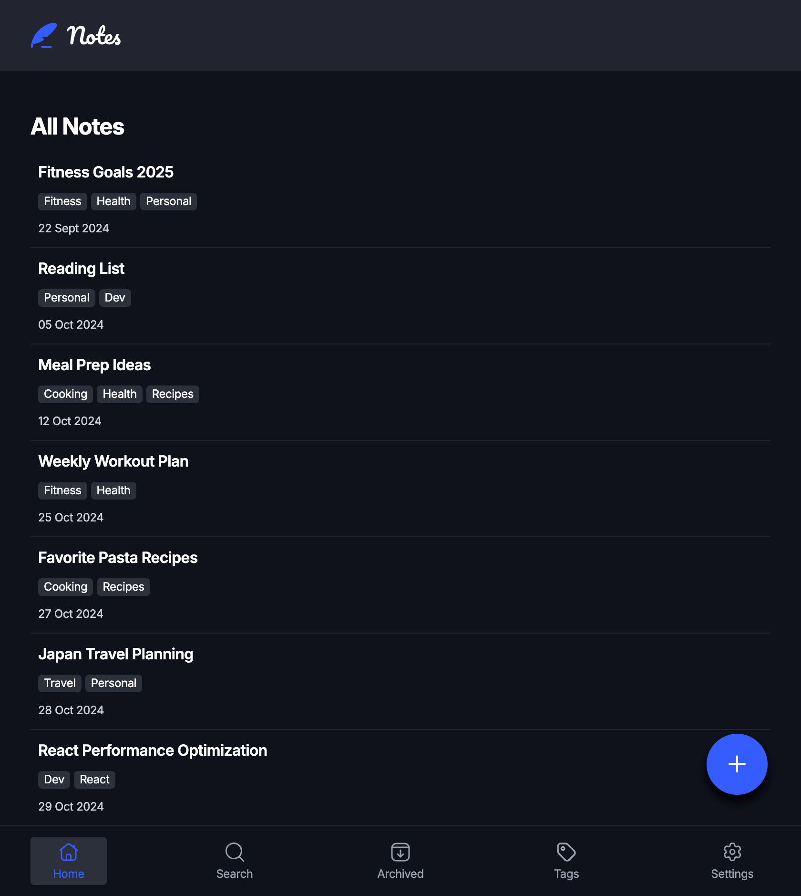
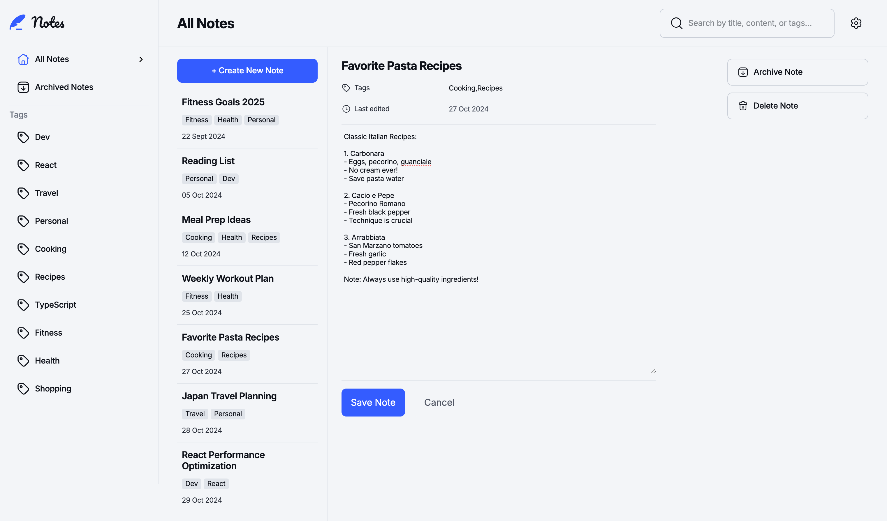
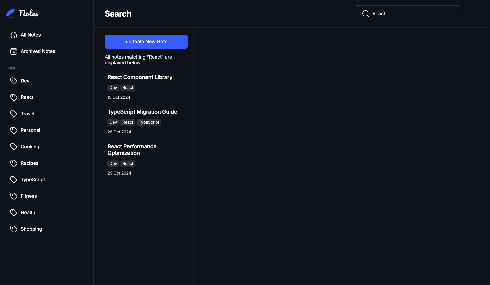
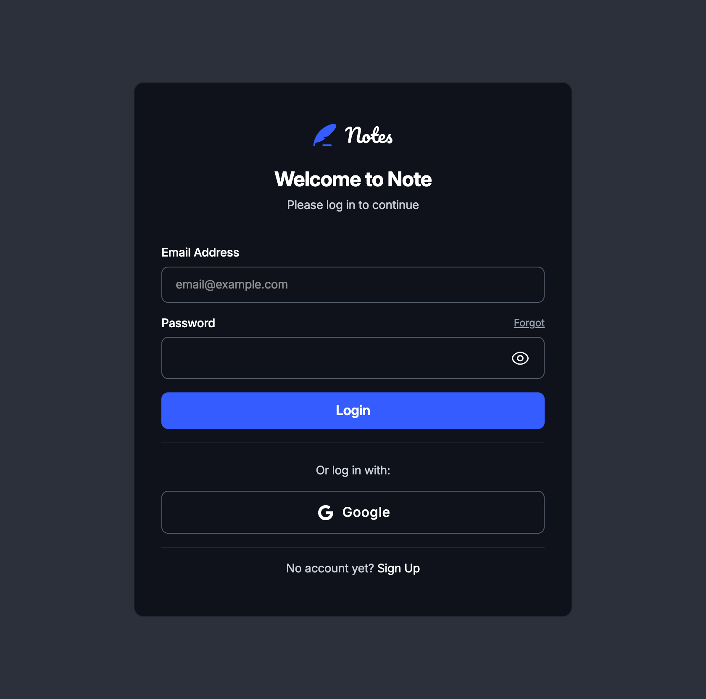
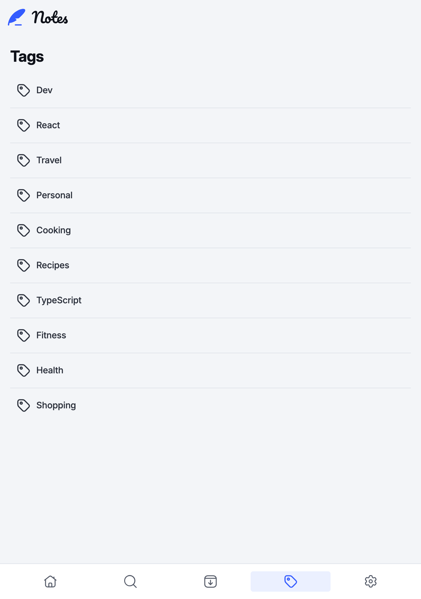
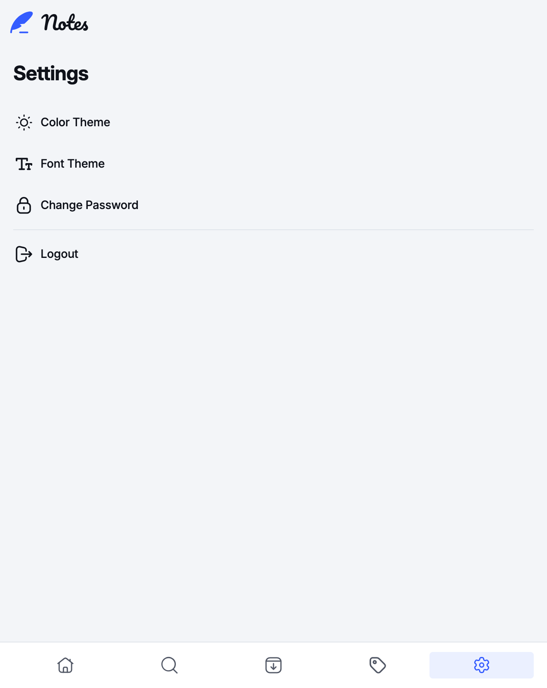

# Frontend Mentor - Note-taking web app solution

This is a solution to the [Note-taking web app challenge on Frontend Mentor](https://www.frontendmentor.io/challenges/note-taking-web-app-773r7bUfOG).

## Table of contents

-   [Overview](#overview)
    -   [The challenge](#the-challenge)
    -   [Screenshot](#screenshot)
    -   [Links](#links)
-   [My process](#my-process)
    -   [Built with](#built-with)
    -   [What I learned](#what-i-learned)
    -   [Continued development](#continued-development)
-   [Author](#author)


## Overview

### The challenge

Users should be able to:

-   Create, read, update, and delete notes
-   Archive notes
-   View all their notes
-   View all archived notes
-   View notes with specific tags
-   Search notes by title, tag, and content
-   Select their color theme
-   Select their font theme
-   See hover and focus states for all interactive elements on the page

### Screenshot

<table>
  <tr>
    <td></td>
    <td></td>
    <td></td>
  </tr>
	
</table>
<table>
	<tr> 
    <td></td>
    <td></td>
    <td></td>
</tr>
</table>

### Links

-   Live Site URL: [[Notes App](https://notes-delta-blue.vercel.app/login)](https://notes-delta-blue.vercel.app/)

## My process

### Built with

-   ⚛️ React 19
-   🧰 Redux Toolkit
-   💨 Tailwind CSS 4
-   ✅ Formik + Yup
-   🌐 React Router 7
-   🍞 React Hot Toast
-   ✨ Framer Motion (via `motion`)
-   🔧 Vite 6

## 📦 Installation

```bash
# Clone the repo
git clone https://github.com/SidorovaMaria/Portfolio.git
cd notes

# Install dependencies
npm install
```

### What I learned

-   Responsive Layouts with Custom Hooks: I learned how to efficiently manage different layouts for various screen sizes using a custom useIsDesktop hook. This helped in rendering a desktop-friendly version of the app for larger screens while optimizing the mobile layout. Below is the custom hook I created to determine if the user is on a desktop:

```js
export const useIsDesktop = () => {
	const [isDesktop, setIsDesktop] = useState(window.innerWidth >= DESKTOP_BREAKPOINT);

	useEffect(() => {
		const handleResize = () => {
			setIsDesktop(window.innerWidth >= DESKTOP_BREAKPOINT);
		};

		window.addEventListener("resize", handleResize);

		// Cleanup on unmount
		return () => {
			window.removeEventListener("resize", handleResize);
		};
	}, []);

	return isDesktop;
};
```

-   **Layout Improvements:** By organizing components more efficiently, I minimized repeated code and streamlined the layout process. This approach enhanced both maintainability and performance.

*   -   Example of Improved Component Layout:

Here’s a DeleteArchiveModal component that demonstrates how I avoided repetitive processes and managed modal actions like delete and archive in one place:

```js
const DeleteArchiveModal = ({ note, mode, close, deleted }) => {
	const dispatch = useDispatch();
	const navigate = useNavigate();

	const modalConfig = {
		delete: {
			title: "Delete Note",
			description:
				"Are you sure you want to permanently delete this note? This action cannot be undone.",
			buttonLabel: "Delete Note",
			buttonClass: "primary-btn-red",
			icon: <DeleteIcon className="w-6 h-6" />,
			action: () => {
				close();
				toast.custom((t) => <CustomToast t={t} message="Note permanently deleted" />);
				setTimeout(() => {
					dispatch(deleteNote(note.id));
				}, 500);
				deleted();
			},
		},
		archive: {
			title: "Archive Note",
			description:
				"Are you sure you want to archive this note? You can find it in the Archived Notes section and restore it anytime.",
			buttonLabel: "Archive Note",
			buttonClass: "primary-btn-blue",
			icon: <ArchiveIcon className="w-6 h-6" />,
			action: () => {
				close();
				toast.custom((t) => (
					<CustomToast
						t={t}
						message="Note Archived"
						linkText="Archived Notes"
						onLinkClick={() => navigate("/archived")}
					/>
				));
				setTimeout(() => {
					dispatch(archiveNote(note.id));
					deleted?.();
				}, 500);
			},
		},
	};
};
```

### Continued development

## Continued Development

-   **Backend Integration**: Add a backend to manage users and data more efficiently, allowing for user authentication, cloud storage, and synchronization across devices.
-   **Tag Customization**: Provide the ability to add colors to tags for better categorization and visual distinction.
-   **Text Formatting**: Implement functionality to highlight, bold, or italicize content within notes, improving note customization and readability.

## Author

-   Website - [Maria Sidorova](https://portfolio-three-bay-82.vercel.app/)
-   Frontend Mentor - [@SidorovaMaria](https://www.frontendmentor.io/profile/SidorovaMaria)
